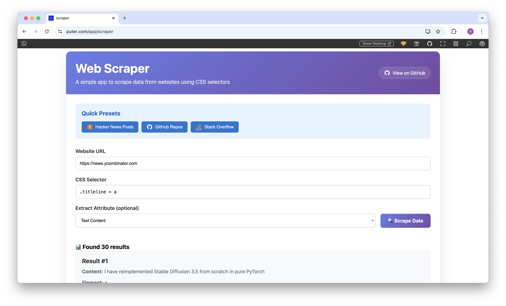

<h1 align="center">
  <a href="https://puter.com/app/scraper" target="_blank">Web Scraper</a>
</h1>

<p align="center">A simple web-based scraping tool that allows you to extract data from websites using CSS selectors.
</p>

<p align="center">
  
</p>


<br>

## Getting Started

Clone the repository: 

```bash
git clone https://github.com/puter-apps/scraper.git
```

and open the `/src/index.html` file in your browser.

<br>

## How It Works

Web Scraper leverages [**Puter.js**](https://developer.puter.com/) to overcome the fundamental challenge of cross-origin requests in web browsers. Traditional web applications are restricted by CORS (Cross-Origin Resource Sharing) policies, which prevent direct requests to external domains from browser-based JavaScript.

Specifically, Web Scraper uses [`puter.net.fetch()`](https://docs.puter.com/Networking/fetch/) to make cross-origin HTTP requests and bypass CORS restrictions without needing a proxy server. This allows the app to scrape public websites without server-side configuration.

The scraped HTML is then parsed using the browser's built-in DOMParser API, and data is extracted using standard CSS selectors via `querySelectorAll()`.

<br>

## License

MIT 
